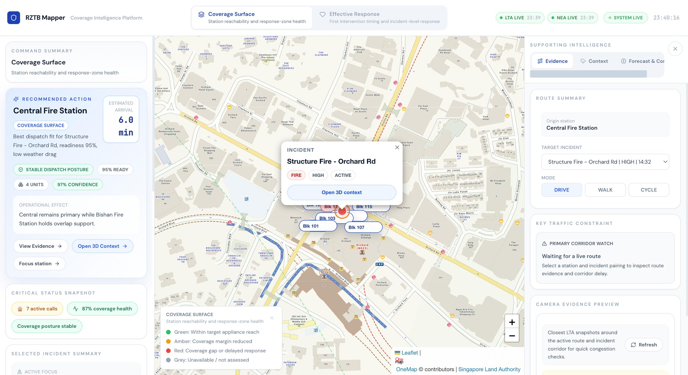
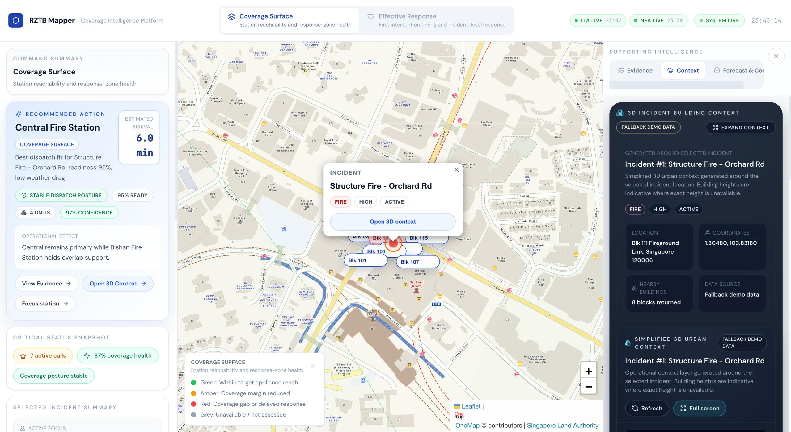
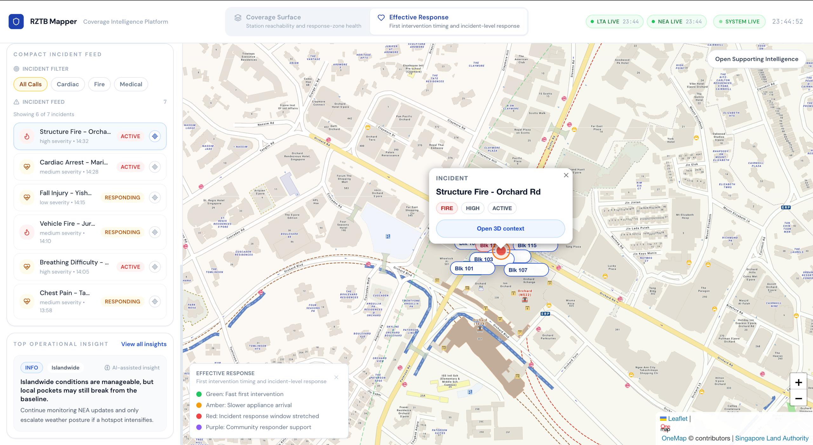
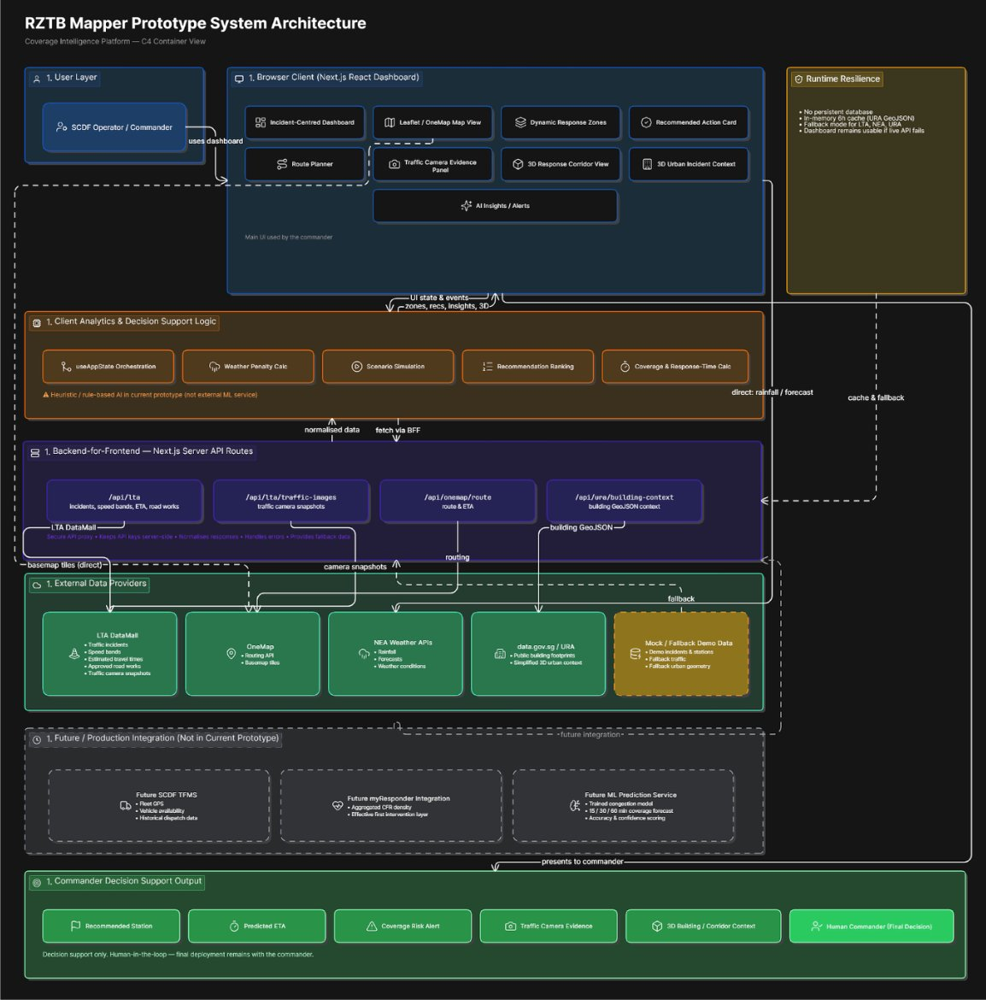

# RZTB Mapper - SCDF Emergency Response Coverage Intelligence

A Next.js / React / TypeScript dashboard for visualising Singapore Civil Defence Force emergency response coverage, live traffic impacts, weather disruptions, and route-aware response planning.

**Live Demo:** [https://wi-fire-scdf-innovation-challenge-7926vyydx-wcnjings-projects.vercel.app/]([https://wi-fire-scdf-innovation-challenge-7926vyydx-wcnjings-projects.vercel.app/](https://wi-fire-scdf-innovation-challenge.vercel.app?_vercel_share=c57p8pZq9PLy1GCjR1t34anALhP8wtTj)






## Features

- Live LTA traffic incidents, speed bands, and expressway travel times
- LTA traffic camera snapshots for congestion evidence and AI explainability
- OneMap route planner for drive, walk, and cycle modes
- Indicative urban/building context from the public URA building dataset on data.gov.sg
- Simplified 3D incident building context using Three.js with no Mapbox dependency
- Coverage and response-time operational views
- Weather-aware station penalties using live NEA feeds
- Incident filtering, KPI cards, and AI insight panels
- ML coverage model (LightGBM) trained on OSM road graph + LTA speed bands + NEA rainfall

## Tech Stack

| Layer | Tech |
|-------|------|
| Framework | Next.js 14 (App Router) |
| UI | React 18, TypeScript, TailwindCSS |
| Animation | Framer Motion 11 |
| Maps | OneMap basemap with Leaflet, LTA overlays, OneMap routing, and Three.js incident context |
| ML Pipeline | Python 3, LightGBM, scikit-learn, osmnx, networkx |
| Icons | Lucide React |

## Project Structure

```text
src/
|- app/            # Next.js App Router (layout, page, globals.css, API routes)
|- components/
|  |- map/         # SingaporeMap Leaflet basemap, overlays, corridor visual
|  |- panels/      # Left/right panels, routing widgets, traffic camera evidence
|  |- ui/          # TopBar, PanelToggle
|  `- dashboard/   # KPI cards
|- data/           # Mock stations, incidents, insights
|- hooks/          # App state, live data, routing, traffic camera hooks
|- lib/            # Coverage math and utilities
`- types/          # Shared TypeScript interfaces

model/
|- src/            # Python source (config, features, network, model)
|- notebooks/      # 5 Jupyter notebooks (data ingestion → visualization)
|- data/processed/ # Trained model artifacts, parquets, coverage PNGs
|- requirements.txt
`- .env.example

public/model/      # Static ML coverage heatmap PNGs served by the webapp
```

---

## Deployment

### Live (Vercel)

The app is deployed at:
[https://wi-fire-scdf-innovation-challenge-7926vyydx-wcnjings-projects.vercel.app/](https://wi-fire-scdf-innovation-challenge-7926vyydx-wcnjings-projects.vercel.app/)

To deploy your own instance, import this repo on [vercel.com/new](https://vercel.com/new) and add the environment variables below.

### Local Development

```bash
# 1. Install dependencies
npm install

# 2. Copy env file and add live API tokens as needed
cp .env.local.example .env.local

# 3. Run dev server
npm run dev
```

Open [http://localhost:3000](http://localhost:3000).

### ML Model (Local)

```bash
cd model

# 1. Install Python dependencies
pip install -r requirements.txt

# 2. Copy env file and add API keys
cp .env.example .env
# Edit .env with your LTA_ACCOUNT_KEY, ONEMAP_EMAIL, ONEMAP_PASSWORD

# 3. Run notebooks in order (01 → 05)
jupyter notebook notebooks/
```

Notebook 05 will generate coverage heatmap PNGs and copy them to `public/model/` automatically.

---

## Environment Variables

### Webapp (.env.local)

```env
LTA_API_KEY=your_lta_datamall_key_here
LTA_ACCOUNT_KEY=your_lta_datamall_account_key_here
ONEMAP_API_TOKEN=your_onemap_access_token_here
```

`LTA_API_KEY` powers the live traffic overlays and expressway ETA cards. `LTA_ACCOUNT_KEY` powers the traffic camera snapshot evidence panel. `ONEMAP_API_TOKEN` powers the route planner between a selected fire station and an active incident.

If you use a single LTA DataMall account key for all traffic features, you can place the same value in both `LTA_API_KEY` and `LTA_ACCOUNT_KEY`.

### ML Model (model/.env)

```env
LTA_ACCOUNT_KEY=your_lta_datamall_key
ONEMAP_EMAIL=your_onemap_email
ONEMAP_PASSWORD=your_onemap_password
```

No Mapbox token is required. The main operational map remains Leaflet with OneMap tiles, and the incident-side 3D context uses a tokenless Three.js prototype renderer with an SVG fallback.

## Traffic Camera Snapshots

To enable traffic camera snapshots:

1. Copy `.env.local.example` to `.env.local`.
2. Add your LTA DataMall account key:

```env
LTA_ACCOUNT_KEY=your_lta_datamall_account_key_here
```

The dashboard fetches traffic camera snapshots through the server-side route at `src/app/api/lta/traffic-images/route.ts`, so the LTA `AccountKey` is never exposed to client code.

Important notes:

- Traffic camera image links expire quickly and must be fetched fresh from LTA DataMall.
- The dashboard uses traffic camera snapshots for visual context and AI explainability only.
- The feature does not identify people, licence plates, or individual vehicles.
- The traffic camera panel does not claim to provide live video footage.

## URA Urban Context

The current urban context feature uses the public `data.gov.sg` GeoJSON dataset:

- Master Plan 2019 Building layer
- Dataset ID: `d_e8e3249d4433845bdd8034ae44329d9e`

No URA access key is required for the current implementation.

## Architecture


Important notes:

- The main Singapore map remains the existing Leaflet / OneMap operational map.
- The right-panel and modal 3D incident context use Three.js and do not require a Mapbox token.
- The URA feature provides simplified urban/building context. It does not generate exact real-time 3D building reconstructions.
- The dashboard fetches the public dataset download URL from `data.gov.sg`, then filters nearby building footprints around the selected incident.
- Building blocks are generated around the selected incident and use indicative building heights where exact heights are unavailable.
- If the dataset is unavailable or parsing fails, the dashboard uses fallback demo building blocks so the UI remains usable.
- If WebGL is unavailable or Three.js cannot initialize, the dashboard falls back to a simplified SVG pseudo-3D block view.
- The feature is intended as an indicative urban context and operational context layer for response planning.
- The feature does not identify residents, occupants, individual units, faces, or vehicles.

## Notes

- The current base map is a live OneMap slippy map rendered with Leaflet.
- OneMap routing is integrated through server-side API routes so the token stays out of frontend code.
- If the OneMap token is missing or expired, the route planner will show an inline error state.
- If `LTA_ACCOUNT_KEY` is missing or the traffic image API fails, the rest of the dashboard continues working and the camera panel shows an inline fallback message.
